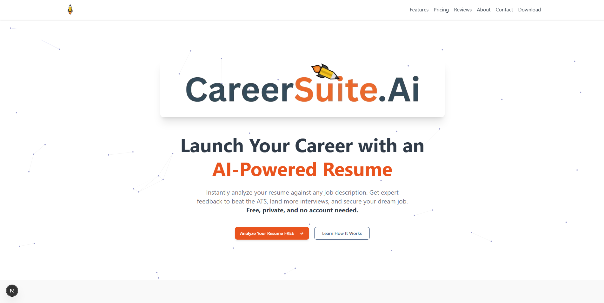

# Francis J. LiButti's Dynamic AI Portfolio 🤖✨

**Why just read a resume when you can *converse* with my experience?** Traditional portfolios are static.
That's why I've leveraged an innovative template to build my dynamic AI portfolio.

This isn't just a website; it's a direct channel to my strategic thinking, data analysis skills, and passion for AI innovation.
Instead of endless scrolling, my AI persona adapts to *your* curiosity. Just ask a question — and get instant, tailored insights into my projects and expertise.

## 👇 What can you ask?

- 🧠 **Tech Recruiter?** Ask about my data-driven impact & AI project results (like CareerSuite.AI!).
- 💻 **Potential Client/Collaborator?** Dive into how I streamline operations & secure high-value outcomes.
- 💡 **Fellow Innovator?** Explore my journey in full-spectrum problem-solving, from AgTech validation (NSF I-Corps) to robotic leadership (HAV Project).

---

This isn't just a portfolio; it’s a **dynamic conversation, shaped by your specific interests**.

➡️ **Try it now:** https://francisjbutti.vercel.app/
*What will you ask?*

---

## 🙏 Acknowledging the Innovation

This interactive experience is built upon the ingenious AI portfolio template originally developed by **Raphaël Giraud** ([https://toukoum.fr](https://toukoum.fr)). His vision of an AI-powered, conversational portfolio perfectly aligned with my goal of showcasing my unique blend of strategic, data, and AI capabilities in an engaging new way. A huge thank you to Raphaël for pioneering this innovative approach!

#### 🔖 Tags

`#AIPortfolio` `#DataAnalytics` `#StrategicProjectManagement` `#AIInnovation` `#TechLeadership` `#ScalableSolutions` `#DigitalTransformation`

---

## Project Structure

The project follows a standard Next.js application structure:

*   `src/app/`: Contains the main pages of the application.
    *   `src/app/about/`: About page.
    *   `src/app/contact/`: Contact page.
    *   `src/app/download/`: Page for resume download.
    *   `src/app/how-it-works/`: Explains the AI interaction.
*   `src/components/`: Reusable UI components.
    *   `src/components/layout/`: Components like Navbar and Footer.
    *   `src/components/magicui/`: Specialized UI components for visual effects.
    *   `src/components/ui/`: General UI elements like buttons, cards, etc.
*   `src/hooks/`: Custom React hooks for shared logic.
*   `src/lib/`: Utility functions and helper scripts.
*   `public/`: Static assets like images and resume PDF.
*   `assets/`: Contains images specifically used in the README.

## Getting Started

To get a local copy up and running, follow these simple steps:

1.  **Clone the repository:**
    Replace `your-username/your-repository-name` with the actual repository path.
    ```bash
    git clone https://github.com/your-username/your-repository-name.git
    cd your-repository-name
    ```
2.  **Install dependencies:**
    This project uses `pnpm` as the package manager.
    ```bash
    pnpm install
    ```
3.  **Run the development server:**
    ```bash
    pnpm dev
    ```
    Open [http://localhost:3000](http://localhost:3000) with your browser to see the result.

## Key Features

This AI-powered portfolio offers a unique and interactive way to explore Francis J. LiButti's skills and experience:

*   **Conversational AI Interface:** Engage in a dynamic dialogue with an AI persona that provides tailored information based on your questions.
*   **Dynamic Content Delivery:** The AI adapts its responses to highlight relevant projects and expertise.
*   **Responsive Design:** Fully responsive and accessible across various devices and screen sizes.
*   **Interactive UI Elements:** Utilizes modern UI components and animations for an engaging user experience.
*   **Detailed Project Showcase:** Offers insights into key projects, methodologies, and outcomes.
*   **Easy Navigation:** Clear and intuitive navigation to different sections of the portfolio including About, Contact, and Resume Download.

## Technologies Used

This project is built with a modern tech stack:

*   **Framework:** Next.js (v15)
*   **Language:** TypeScript
*   **UI Library:** React (v19)
*   **Styling:** Tailwind CSS (v4)
*   **AI SDK:** Vercel AI SDK, OpenAI
*   **UI Components:** Shadcn/UI, MagicUI
*   **Animations:** Framer Motion
*   **Linting & Formatting:** ESLint, Prettier
*   **Package Manager:** pnpm

## Deployment

This portfolio is continuously deployed on [Vercel]([https://vercel.com/](https://careersuiteai.vercel.app/)). You can access the live version here: https://francisjbutti.vercel.app/
